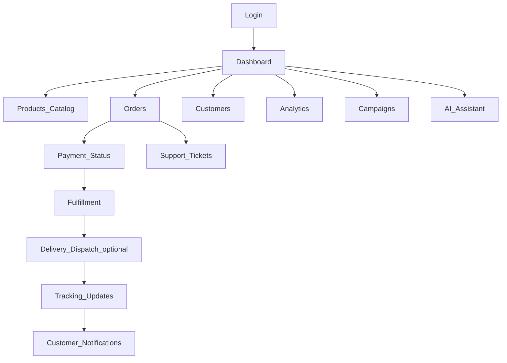
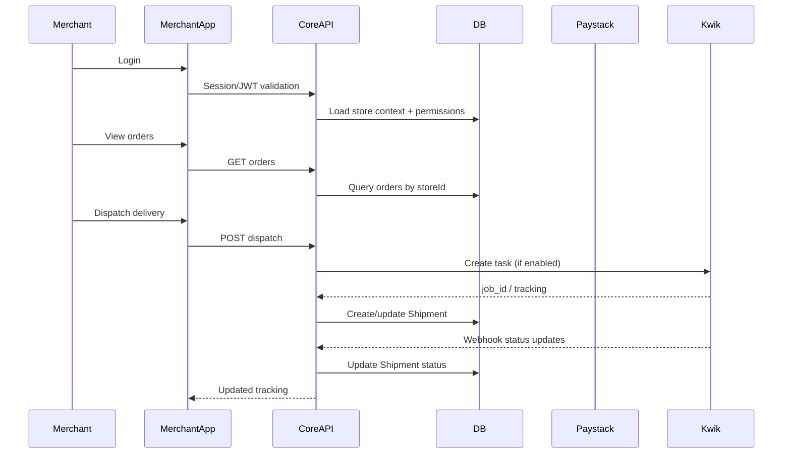

# Existing user flow (Merchant) — Vayva

**Audience:** Exec + product + engineering\n
**Goal:** Explain ongoing day-to-day usage for an already-onboarded merchant.\n

---

## Executive summary

Existing merchants: **login → manage products/orders → collect payments → dispatch delivery → track → support → analytics → campaigns → AI**.

---

## Flow (product)

---

## Deep technical flow (engineering)

