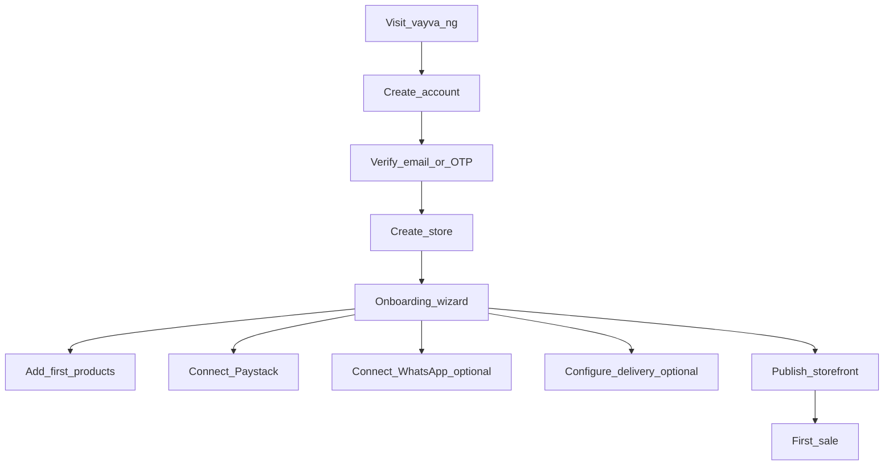
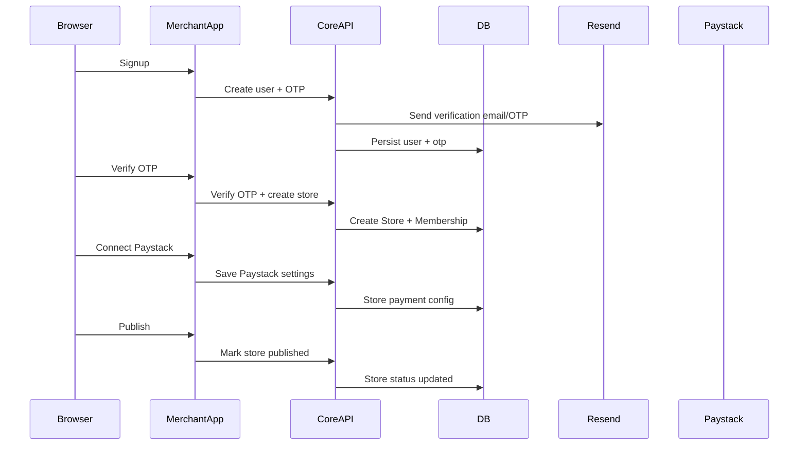

# New user flow (Merchant) — Vayva

**Audience:** Exec + product + engineering\n
**Goal:** Explain what happens when a new merchant signs up and goes live.\n

---

## Executive summary

New merchants go through: **Signup → Store creation → Onboarding setup → Connect Paystack → (Optional) link WhatsApp by scanning QR → Add products → Publish → First order**.

---

## Step-by-step flow (product)

---

## Deep technical flow (engineering)

### Main systems involved
- Merchant dashboard (`Frontend/merchant`)
- Core API (`Backend/core-api`)
- DB (Postgres/Prisma)
- Paystack, Resend, OpenRouter, Evolution API (optional), Kwik (optional)
- **Note:** Vayva hosts Evolution API on our VPS — “Connect WhatsApp” means **scan a QR code (or use pairing code)** to link the merchant’s WhatsApp number.

