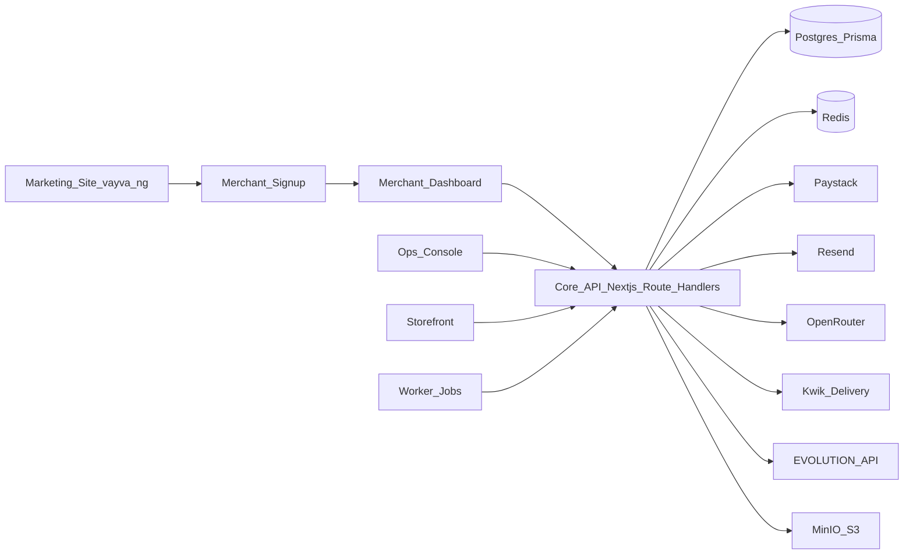
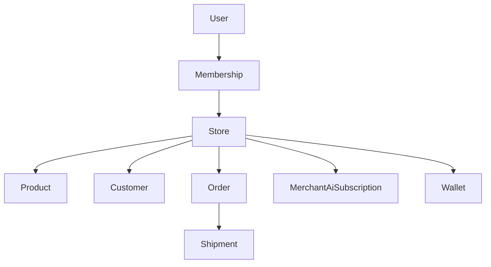
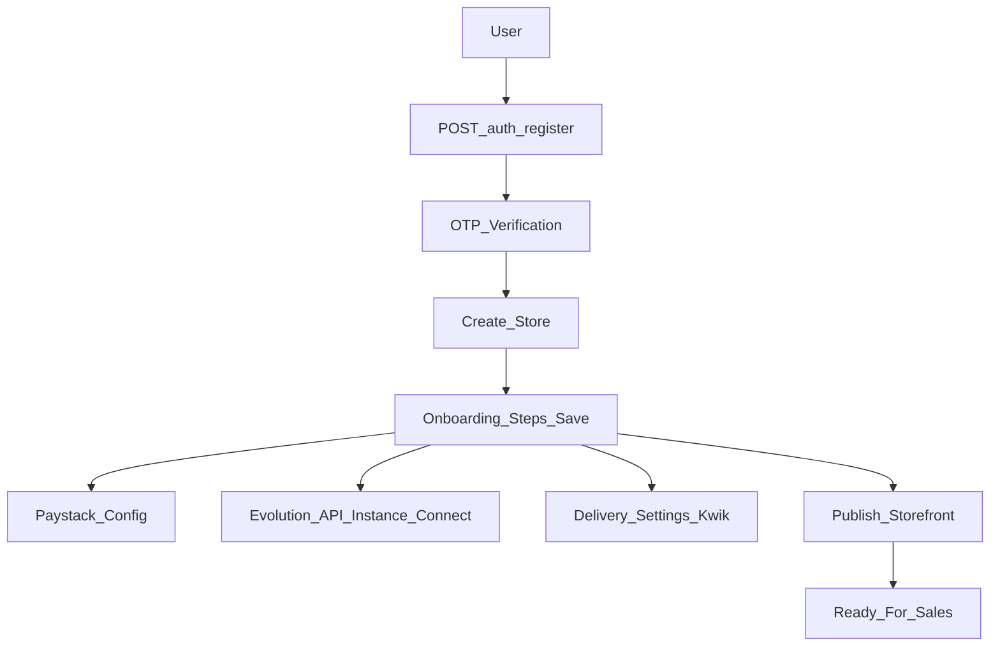
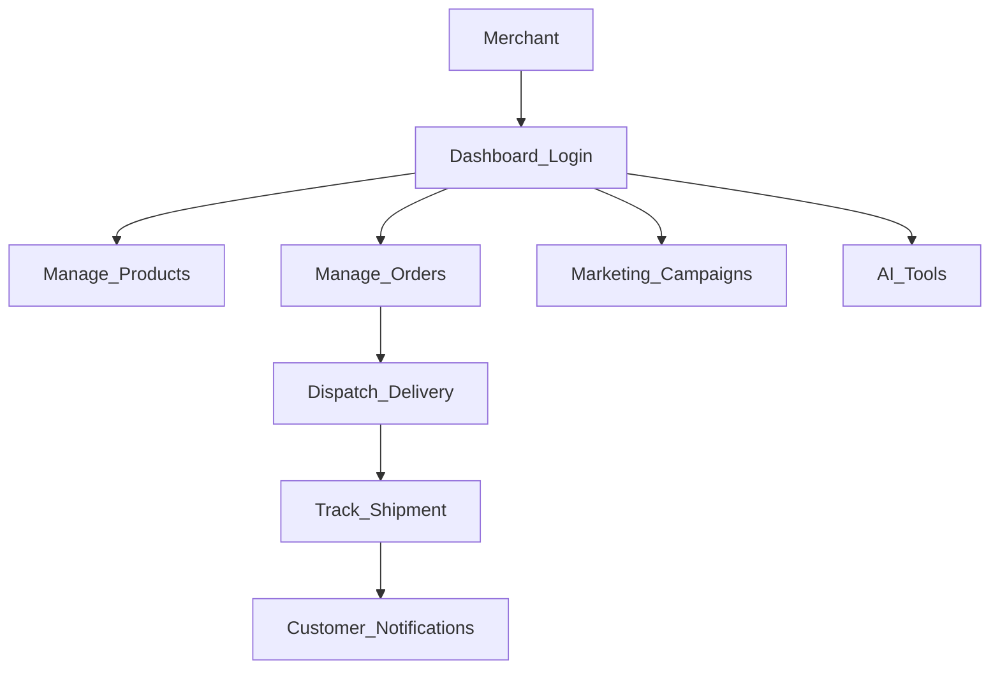
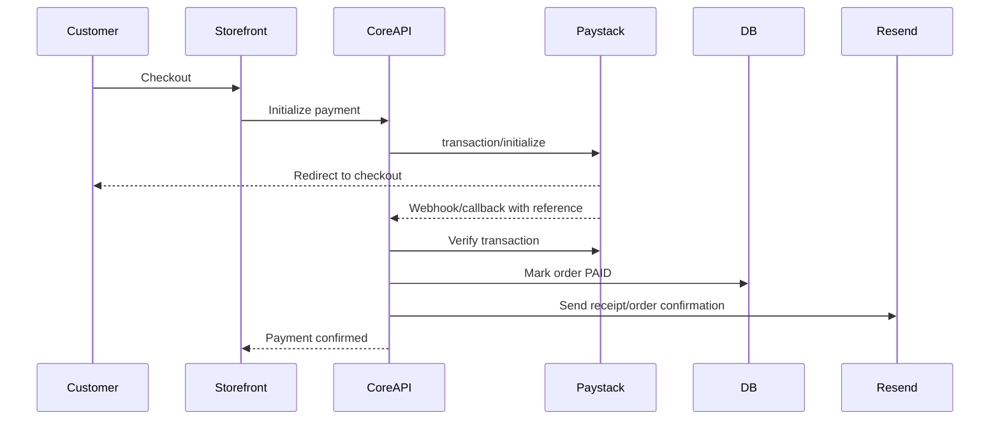
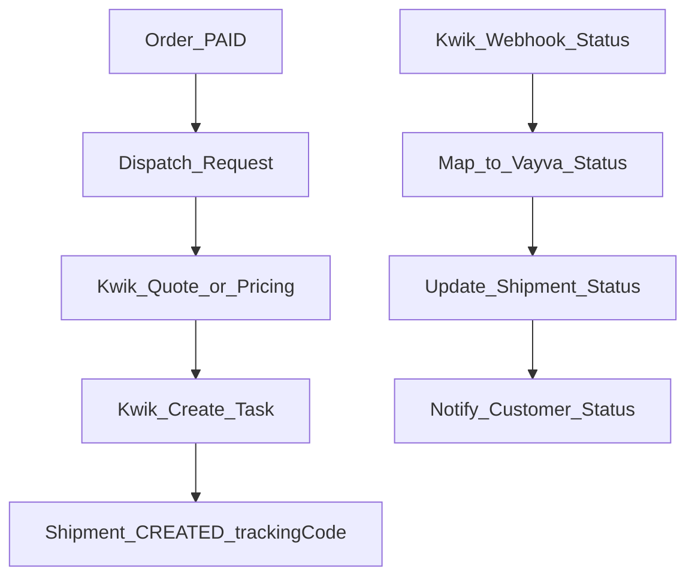
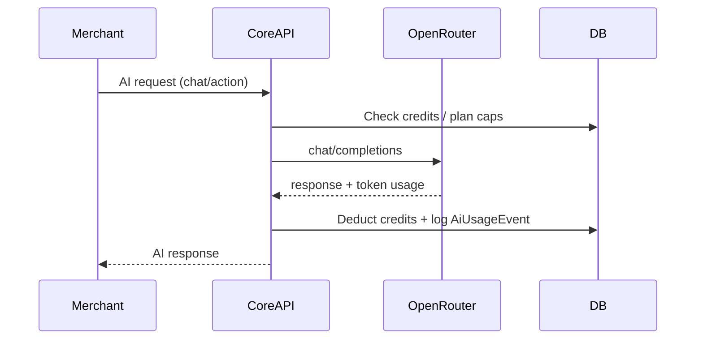
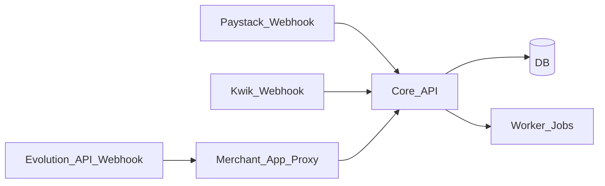

# Vayva Operations Handbook (How Vayva Works)

**Audience:** Executive overview + deep technical runbook\n
**Goal:** Give anyone a detailed understanding of Vayva’s internal operating flow.\n

---

## Executive overview (1-page)

Vayva is a WhatsApp-first commerce OS. Merchants onboard, connect channels (Paystack, WhatsApp), add products, and start receiving orders. **Vayva hosts the WhatsApp gateway (Evolution API) on our VPS** — merchants simply **scan a QR code (or use pairing code)** to link their WhatsApp number.

### Systems (high level)

---

## Deep technical handbook

## Core data model (conceptual)

---

## New merchant onboarding flow (new user)

### What the merchant experiences
- Create account → verify email/OTP
- Create store → choose industry
- Add first product/service
- Connect Paystack
- (Optional) connect WhatsApp channel (scan QR / pairing code)
- Configure delivery (Kwik) and store policies
- Publish storefront

### System flow

---

## Existing merchant flow (daily usage)

---

## Checkout + payment (storefront order)

---

## Delivery dispatch + tracking (Kwik)

### Key concepts from Kwik docs
- Pricing is computed per job (distance + service charge + surge + add-ons).\n
  Reference: `https://apikwik.docs.apiary.io` and Kwik public FAQ.
- Kwik sends status updates to Vayva via webhook; Vayva maps to internal shipment statuses.

---

## AI usage + credits (OpenRouter)

---

## Webhooks overview (what hits Vayva)

---

## Failure modes (ops checklist)

- **Payments**: webhook retries/idempotency; verify by reference; guard against double-credit/double-fulfillment.\n
- **Delivery**: webhook signature validation; ignore unknown statuses; prevent status rollback.\n
- **AI**: enforce credit deduction and block when insufficient.\n
- **WhatsApp**: Evolution instance disconnect; implement health checks and merchant alerts.\n
- **Storage**: MinIO credentials missing → disable upload features; pre-signed URL expiry.\n

---

## Further reading (runbooks & references)

- Webhook verification and idempotency: `docs/06_security_compliance/webhooks.md`
- Rate limiting policy: `docs/06_security_compliance/rate-limiting.md`
- Cron jobs: `docs/05_operations/automation/cron-jobs.md`
- Job queues: `docs/05_operations/automation/job-queue-operations.md`
- Wallet & payouts: `docs/05_operations/finance/wallet-payouts.md`
- Stripe: `docs/08_reference/integrations/stripe.md`
- Shopify: `docs/08_reference/integrations/shopify.md`

